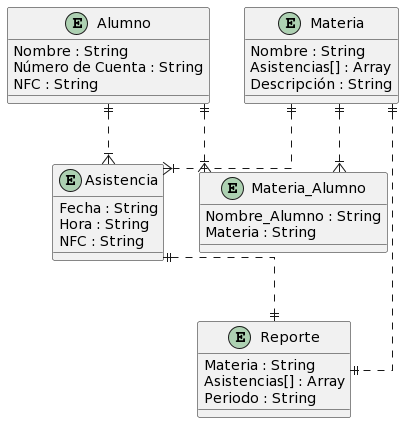



/'
@startuml

skinparam linetype ortho

entity "Alumno" as Alm{
  Nombre : String
  Número de Cuenta : String 
  NFC : String
}

entity "Materia_Alumno" as MyA{
  Nombre_Alumno : String
  Materia : String
}

entity "Materia" as Mat{
  Nombre : String
  Asistencias[] : Array
  Descripción : String
}

entity "Asistencia" as Ass{
  Fecha : String
  Hora : String
  NFC : String
}

entity "Reporte" as Inf{
  Materia : String
  Asistencias[] : Array
  Periodo : String
}

'Alm, MyA, Mat, Prf, Ass, AyA, Inf, Nfc, NyA

Alm ||..|{ MyA
Mat ||..|{ MyA
Alm ||..|{ Ass
Mat ||..|| Inf
Ass ||..|| Inf
Mat ||..|{ Ass

@enduml
'/
