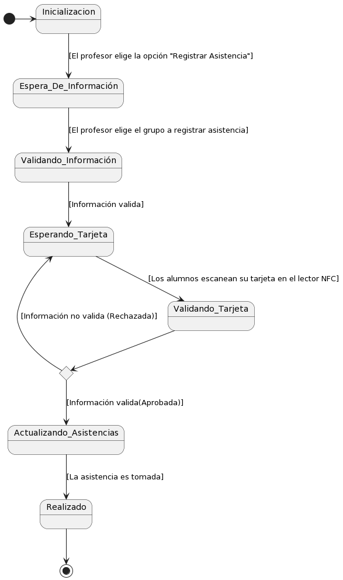



<!--
@startuml

state c <<choice>>

state c1 <<choice>>

[\*] -> Inicializacion

Inicializacion --> Espera\_De\_Información : [El profesor elige la opción "Registrar Asistencia"] -->

<!--
Espera\_De\_Información --> Validando\_Información : [El profesor elige el grupo a registrar asistencia] -->
<!--
Validando\_Información --> c -->
<!--
c --> Espera\_De\_Información : [Información no valida (Rechazada)] -->
<!--
c --> Esperando\_Tarjeta : [Información valida (Aprovada)] -->
<!--
Esperando\_Tarjeta --> Validando\_Tarjeta : [Los alumnos escanean su tarjeta en el lector NFC] -->
<!--
Validando\_Tarjeta --> c1 -->
<!--
c1 --> Esperando\_Tarjeta : [Información no valida (Rechazada)] -->
<!--
c1 --> Actualizando\_Asistencias : [Información valida(Aprovada)] -->
<!--
Actualizando\_Asistencias --> Realizado : [La asistencia es tomada] -->
<!--
Realizado --> [\*] -->
<!--
@enduml
-->
