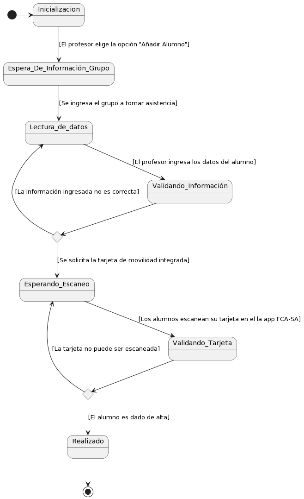

 
 <!--
 @startuml

state c <<choice>>

state c1 <<choice>>

[\*] -> Inicializacion

Inicializacion -> Espera\_De\_Información : [El profesor elige la opción "Añadir Alumno"]

Espera\_De\_Información -> Validando\_Información : [El profesor ingresa la información del alumno]

Validando\_Información -> c

c -> Espera\_De\_Información : [Información no valida (Rechazada)]

c -> Esperando\_Escaneo : [Información valida (Aprovada)]

Esperando\_Escaneo -> Validando\_Tarjeta : [Los alumnos escanean su tarjeta en el lector NFC]

Validando\_Tarjeta -> c1

c1 -> Esperando\_Escaneo : [Información no valida (Rechazada)]

c1 -> Realizado : [Información valida(Aprovada)]

Realizado -> [\*]

@enduml
