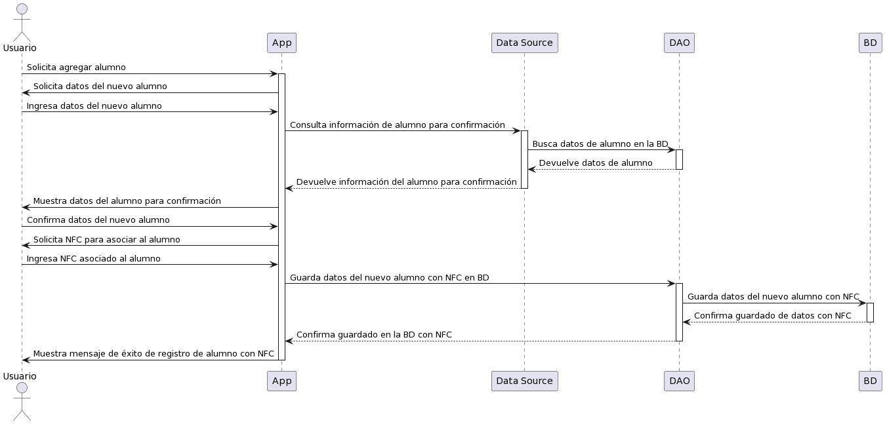



/'
@startuml
actor Usuario as Profesor
participant App
participant "Data Source" as DataSource
participant DAO as Dao
participant BD as BaseDatos

Profesor -> App: Solicita agregar alumno
activate App
App -> Profesor: Solicita datos del nuevo alumno
Profesor -> App: Ingresa datos del nuevo alumno
App -> DataSource: Consulta información de alumno para confirmación
activate DataSource
DataSource -> Dao: Busca datos de alumno en la BD
activate Dao
Dao --> DataSource: Devuelve datos de alumno
deactivate Dao
DataSource --> App: Devuelve información del alumno para confirmación
deactivate DataSource
App -> Profesor: Muestra datos del alumno para confirmación
Profesor -> App: Confirma datos del nuevo alumno
App -> Profesor: Solicita NFC para asociar al alumno
Profesor -> App: Ingresa NFC asociado al alumno
App -> Dao: Guarda datos del nuevo alumno con NFC en BD
activate Dao
Dao -> BaseDatos: Guarda datos del nuevo alumno con NFC
activate BaseDatos
BaseDatos --> Dao: Confirma guardado de datos con NFC
deactivate BaseDatos
Dao --> App: Confirma guardado en la BD con NFC
deactivate Dao
App -> Profesor: Muestra mensaje de éxito de registro de alumno con NFC
deactivate App
@enduml
'/
