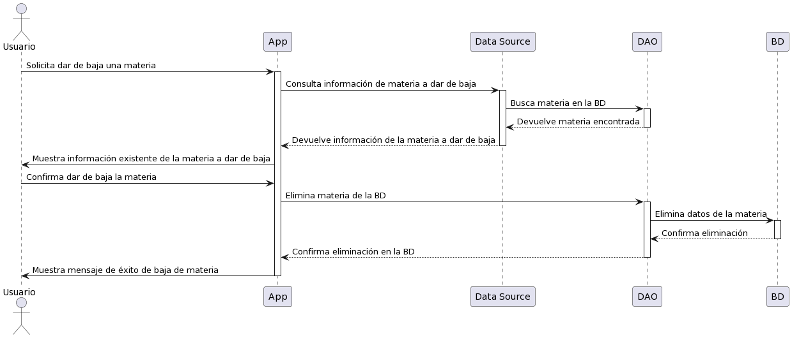



/'
@startuml
actor Usuario as Profesor
participant App
participant "Data Source" as DataSource
participant DAO as Dao
participant BD as BaseDatos

Profesor -> App: Solicita dar de baja una materia
activate App
App -> DataSource: Consulta información de materia a dar de baja
activate DataSource
DataSource -> Dao: Busca materia en la BD
activate Dao
Dao --> DataSource: Devuelve materia encontrada
deactivate Dao
DataSource --> App: Devuelve información de la materia a dar de baja
deactivate DataSource
App -> Profesor: Muestra información existente de la materia a dar de baja
Profesor -> App: Confirma dar de baja la materia
App -> Dao: Elimina materia de la BD
activate Dao
Dao -> BaseDatos: Elimina datos de la materia
activate BaseDatos
BaseDatos --> Dao: Confirma eliminación
deactivate BaseDatos
Dao --> App: Confirma eliminación en la BD
deactivate Dao
App -> Profesor: Muestra mensaje de éxito de baja de materia
deactivate App
@enduml
'/
