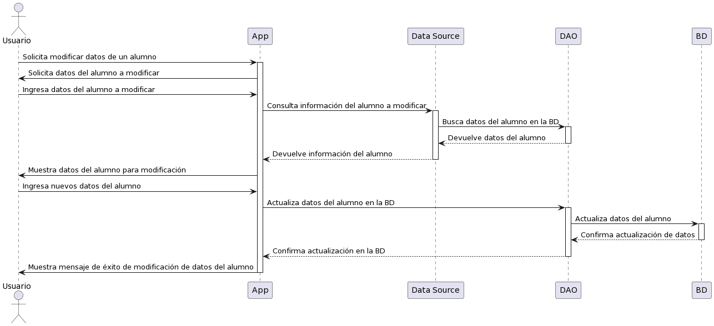



/'
@startuml
actor Usuario as Profesor
participant App
participant "Data Source" as DataSource
participant DAO as Dao
participant BD as BaseDatos

Profesor -> App: Solicita modificar datos de un alumno
activate App
App -> Profesor: Solicita datos del alumno a modificar
Profesor -> App: Ingresa datos del alumno a modificar
App -> DataSource: Consulta información del alumno a modificar
activate DataSource
DataSource -> Dao: Busca datos del alumno en la BD
activate Dao
Dao --> DataSource: Devuelve datos del alumno
deactivate Dao
DataSource --> App: Devuelve información del alumno
deactivate DataSource
App -> Profesor: Muestra datos del alumno para modificación
Profesor -> App: Ingresa nuevos datos del alumno
App -> Dao: Actualiza datos del alumno en la BD
activate Dao
Dao -> BaseDatos: Actualiza datos del alumno
activate BaseDatos
BaseDatos --> Dao: Confirma actualización de datos
deactivate BaseDatos
Dao --> App: Confirma actualización en la BD
deactivate Dao
App -> Profesor: Muestra mensaje de éxito de modificación de datos del alumno
deactivate App
@enduml
'/
